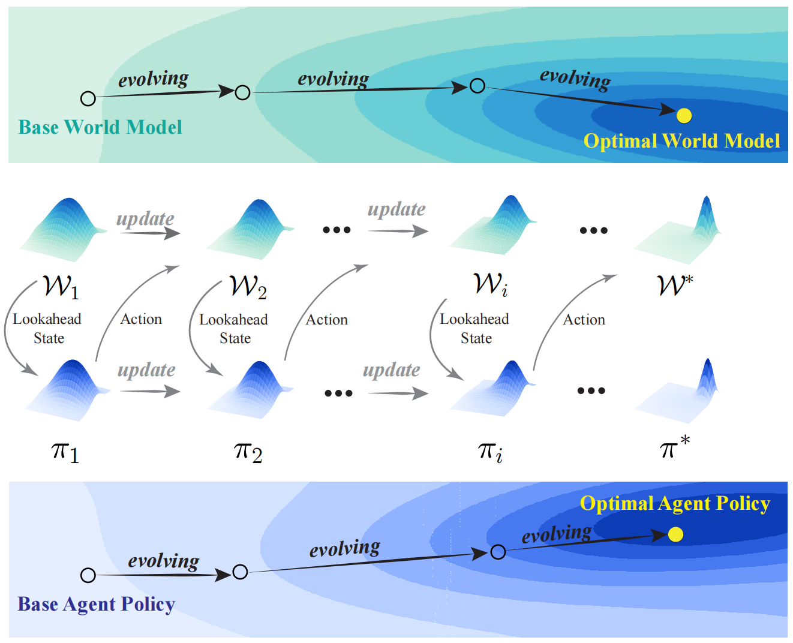
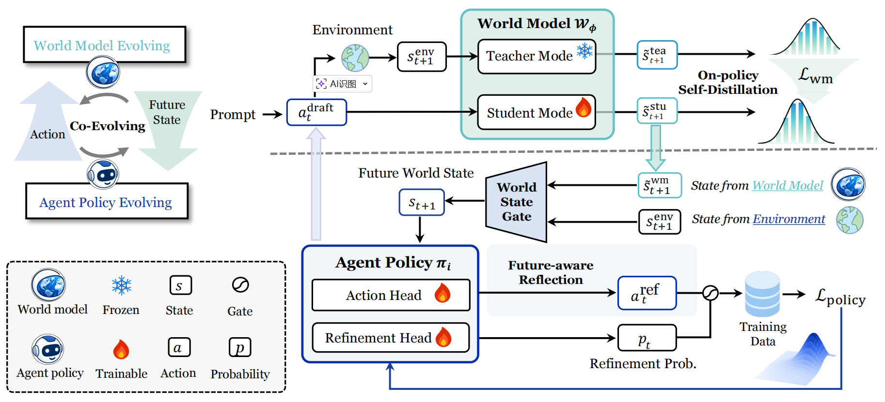

# CoMAP

Code of paper: **Co-Evolving World Models and Agent Policies for LLM Agents**

## Overview

  

**Figure 1. Conceptual illustration of CoMAP.**  
CoMAP co-evolves the world model and the agent policy in a closed loop. The world model provides lookahead states for policy improvement, while the agent policy generates on-policy interactions for world-model updating.

  

**Figure 2. Framework overview.**  
At each step, the agent first drafts an action, the world model predicts its future state, and the policy performs future-aware reflection to refine the action. The resulting trajectories are used for on-policy self-distillation of the world model and policy-side evolution.
